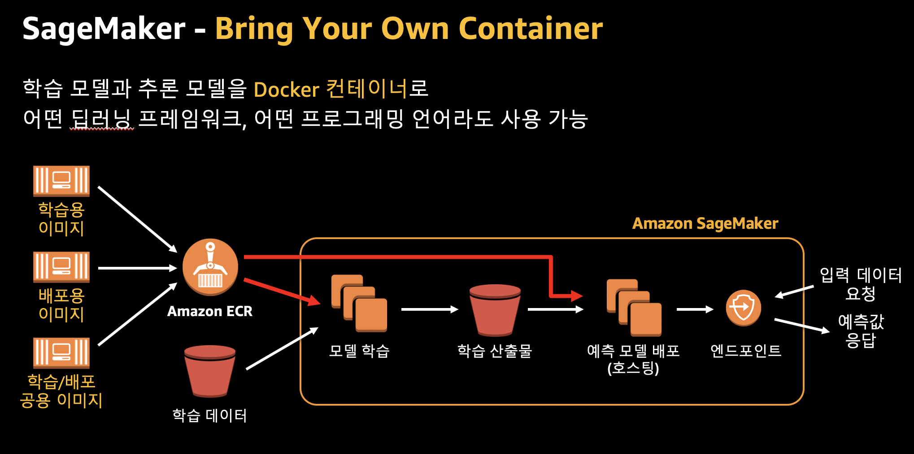

# SageMaker Bring Your Own Container (BYOC)

아래의 그림은 개괄적인 BYOC를 셜명 합니다.
1. docker image(학습용, 배포용 혹은 학습/배포용) 를 생성 합니다. 아래와 같은 단계가 있습니다.
    - Train/Serve script 작성 
    - Dockerfile 작성
    - Docker container 빌드
    - [옵션] Docker container 로컬에서 테스트
2. ECR에 Docker container 푸시
3. 학습의 단계로서 Estimator를 생성하여 인자인 ECR에 등록된 Docker container 위치 및 S3의 입력 데티터 제공
4. 학습 완료후에 모델의 아티펙트(학습 산출물)는 S3에 저장 됨.
5. 예측 모델 (추론 모델) 배포
6. 엔드 포인트 생성
7. 엔드 포인트에 추론 요청 및 결과 받음

## BYOC 가이드 문서  

1. 개략적인 이해를 위해서는 아래 첨부 파일을 확인 하세요.
    - [BYOC Overview](Sagemaker-BYOC-seongmoon.pdf)
    

2. 개발자 가이드의 Get Started 참고 하세요.
[Get Started: Build Your Custom Training Container with Amazon SageMaker]((https://docs.aws.amazon.com/sagemaker/latest/dg/build-container-to-train-script-get-started.html) 링크를 누르시면 상세 설명이 있습니다.

3. 사용자의 알고리즘을 가져오는 방법을 설명하는 엔트리 페이지 입니다.  
BYOC 관점으로 "Extend a pre-built container image", "Build your own custom contaienr image" 를 확인하시면 됩니다.
- Use Your Own Algorithms or Models with Amazon SageMaker 
https://docs.aws.amazon.com/sagemaker/latest/dg/your-algorithms.html

## 예제 노트북

#### 1. ubuntu:16.04 Base Image로 이용

아래의 노트북은 iris 데이타 셋으로 Scikit Learn을 이용하여 Decision Tree 알고리즘을 작성하고, BYOC 의 단계를 수행 및 Endpoint 생성하여 추론 까지 하는 예제 입니다. 생성한 custome docker container는 학습/추론에 모두 사용되게 구성 되어 있습니다.

- Git: [Building your own algorithm container](https://github.com/awslabs/amazon-sagemaker-examples/blob/master/advanced_functionality/scikit_bring_your_own/scikit_bring_your_own.ipynb)
- Blog: [Train and host Scikit-Learn models in Amazon SageMaker by building a Scikit Docker container](https://aws.amazon.com/ko/blogs/machine-learning/train-and-host-scikit-learn-models-in-amazon-sagemaker-by-building-a-scikit-docker-container/#building)

#### 2. Prebuilt SageMaker Container Image를 Base Image로 이용

**빠르게 예제를 확인 원하시면 아래 (3) 의 "churn-prediction-workshop2" 를 확인 하세요.**

(1) 아래의 노트북은 cifar10 이미지 데이터로 Tensorflow에서 알고리즘을 작성하고 , BYOC 의 단계를 수행 및 Endpoint 생성하여 추론 까지 하는 예제 입니다. 생성한 custome docker container는 학습/추론에 모두 사용되게 구성 되어 있습니다.
- [Building your own TensorFlow container](https://github.com/awslabs/amazon-sagemaker-examples/blob/master/advanced_functionality/tensorflow_bring_your_own/tensorflow_bring_your_own.ipynb)
    - 추론단계에서 추론 전용의 docker container를 사용할 수 있습니다. Tensforflow의 경우에는 tensorflow-serving 추론 이미지를 주로 사용 합니다.[SageMaker TensorFlow Serving Container](https://github.com/aws/sagemaker-tensorflow-serving-container)

(2) 아래의 노트북은 "how to extend a prebuilt Amazon SageMaker PyTorch container image"으로 예제로써 이미 제공된 pytorch framework docker image를 기반으로 Dockerfile을 만들고 cifar10에 대한 이미지를 학습하여 추론하는 예제 입니다. 
- [pytorch_extending_our_containers](https://github.com/awslabs/amazon-sagemaker-examples/blob/master/advanced_functionality/pytorch_extending_our_containers/pytorch_extending_our_containers.ipynb)

(3) 아래의 두개의 노트북은 Prebuilt Scikit Learn, Tensorflow docker image를 확장한 예제 입니다.
- churn-prediction-workshop2에 있는 [[Module 3.2] Custom PCA Docker Image 생성 및 ECR Model 학습](https://github.com/gonsoomoon-ml/churn-prediction-workshop2/blob/master/3.2.Make-BYOC-Custom-PCA-Docker.ipynb) 은 pre-built Scikit Learn docker image를 확장한 예 입니다.
- "Tweet의 감정상태에 따른 이모티콘 추천"에 있는 [[Module 3.4.1] Train Docker Image 생성 및 ECR 퍼블리시](https://github.com/gonsoomoon-ml/RecommendEmoticon/blob/master/Tweet-BERT/3.4.1.Make-Train-Image-ECR.ipynb) 는 pre-built tensorflow2.1 docker image를 확장한 예 입니다.

(4) 공식 개발자 문서에 있는 내용 입니다. 위에 언급한 예제들은 아래 링크에서 일부 가져 왔습니다.
[Example Notebooks: Use Your Own Algorithm or Model](https://docs.aws.amazon.com/sagemaker/latest/dg/adv-bring-own-examples.html)

### Amazon SageMaker Custom Training containers
- SageMaker-compatible training container를 만든는 유형 및 예제 코드가 있습니다. 
    - 유형은 크게 "Basic Training Container", "Script Mode Container", "Script Mode Container2", "Framework Container" 로 구분 되어 있습니다.
https://github.com/awslabs/amazon-sagemaker-examples/tree/master/advanced_functionality/custom-training-containers

## 참고:

- Prebuilt Amazon SageMaker Docker Images for Scikit-learn and Spark ML
    - SKLearn 빌트인 이미지 리스트 
    https://docs.aws.amazon.com/sagemaker/latest/dg/pre-built-docker-containers-frameworks.html
    

- Available Deep Learning Containers Images
    - Tensorflow, PyTorch, MXNet 빌트인 이미지 리스트 
    https://github.com/aws/deep-learning-containers/blob/master/available_images.md

- SageMaker Inference Toolkit
    - 추론용 커스텀 이미지를 만드는 가이드 
    https://github.com/aws/sagemaker-inference-toolkit

- Bring Your Own Model (XGboost)
    - BYOM (로컬에서 모델 생성 후에 세이지 메이커에서 배포)  
    https://github.com/awslabs/amazon-sagemaker-examples/tree/master/advanced_functionality/xgboost_bring_your_own_model

- Using Scikit-learn with the SageMaker Python SDK
    - 공식 세이지메이커 Python SDK 홈 입니다. 
    https://sagemaker.readthedocs.io/en/stable/frameworks/sklearn/using_sklearn.html#id2

- 초보를 위한 도커 안내서 - 이미지 만들고 배포하기
    https://subicura.com/2017/02/10/docker-guide-for-beginners-create-image-and-deploy.html

